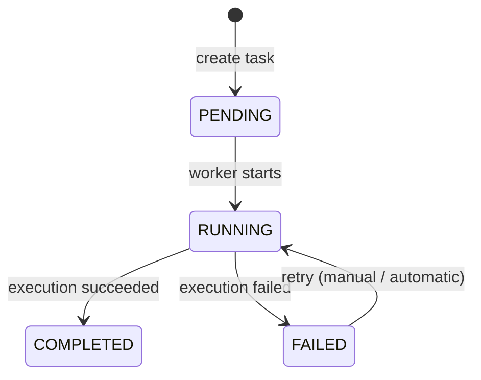

# Task ライフサイクル

本ドキュメントでは、Async Job Executor における  
**タスクの登録から実行、完了（または失敗）に至るまでのライフサイクル** を説明します。

本システムでは、非同期処理を前提とし、  
タスクの状態管理と実行履歴の管理を明確に分離しています。

---

## 概要

タスクは API 経由で登録され、  
非同期に Worker によって実行されます。

- タスクの現在状態は `tasks` テーブルで管理
- 各実行試行の履歴は `task_executions` に記録
- 実行中の詳細なイベントは `task_execution_logs` に追記型で保存

この構成により、  
**再実行・障害調査・監査を容易にすること** を目的としています。

---

## Task の状態一覧（`tasks.status`）

Task は以下のいずれかの状態を持ちます。

| 状態        | 説明                                           |
| ----------- | ---------------------------------------------- |
| `PENDING`   | タスクが登録されたが、まだ実行されていない状態 |
| `RUNNING`   | 現在、Worker により実行中の状態                |
| `COMPLETED` | 実行が正常に完了した状態                       |
| `FAILED`    | 実行が失敗し、現在は停止している状態           |

Task の状態は **ユーザー視点での要約状態** として扱い、  
詳細な実行状況や失敗理由は TaskExecution 側で管理します。

---

## TaskExecution との関係

TaskExecution は、  
**1 回の実行試行を表す短命なエンティティ** です。

- 1 つの Task は複数の TaskExecution を持つ
- リトライが行われるたびに、新しい TaskExecution が作成される
- Task の状態は「最新の TaskExecution の結果」を要約したもの

この分離により、

- 状態爆発を防止
- 再実行履歴の保持
- 実行結果の再現性確保

を実現しています。

---

## 状態遷移の考え方

Task の状態遷移は、  
**外部イベント（API 操作や Worker の実行結果）** によってのみ発生します。

- 状態遷移は必ず DB トランザクション内で行う
- 不正な遷移はガード条件により防止する
- 同一 Task の同時実行を許可しない設計とする

---

## 状態遷移図

